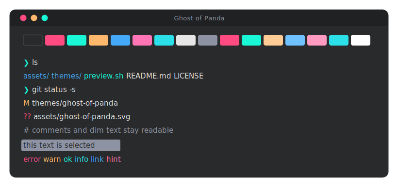

# 🐼 Ghost of Panda

A [Ghostty](https://ghostty.org) terminal theme inspired by
[**Panda**](https://github.com/PandaTheme), retuned so every color meets WCAG AA contrast.
The name is a play on words: **Ghost**ty + **Panda**.

Panda is a warm, dark theme that is no longer actively maintained and never shipped a
Ghostty port. Ghost of Panda keeps its pink, teal, and orange character while making every
color comfortably readable on the dark background. It is an independent, unaffiliated tribute.


## Preview



See it live in your own terminal, too. With the theme active, run the included script:

```bash
./preview.sh
```

It prints all 16 ANSI colors as swatches, a sample sentence per color, and dark text on
each color, so you can judge readability at a glance.

## Installation

### Quick install (just the theme file)

```bash
mkdir -p ~/.config/ghostty/themes
curl -fLo ~/.config/ghostty/themes/ghost-of-panda \
  https://raw.githubusercontent.com/itsacoyote/ghost-of-panda/main/themes/ghost-of-panda
```

### Or clone the repo

```bash
git clone https://github.com/itsacoyote/ghost-of-panda.git
mkdir -p ~/.config/ghostty/themes
cp ghost-of-panda/themes/ghost-of-panda ~/.config/ghostty/themes/
```

> On Linux, Ghostty also reads themes from `$XDG_CONFIG_HOME/ghostty/themes` when `XDG_CONFIG_HOME` is set.

### Enable it

Add this line to your Ghostty config at `~/.config/ghostty/config` (create the file if it
doesn't exist yet):

```
theme = ghost-of-panda
```

Then reload your config with <kbd>⌘</kbd>+<kbd>⇧</kbd>+<kbd>,</kbd> on macOS (or restart Ghostty).

## Palette

Every text color clears WCAG AA (>= 4.5:1) against the background; most reach AAA.

| Slot | Role | Hex | | Slot | Role | Hex |
|---:|---|---|---|---:|---|---|
| 0 | black | `#292A2B` | | 8 | bright black | `#8E93A4` |
| 1 | red | `#FF4B82` | | 9 | bright red | `#FF4B82` |
| 2 | green | `#19F9D8` | | 10 | bright green | `#19F9D8` |
| 3 | yellow | `#FFB86C` | | 11 | bright yellow | `#FFCC95` |
| 4 | blue | `#45A9F9` | | 12 | bright blue | `#6FC1FF` |
| 5 | magenta | `#FF75B5` | | 13 | bright magenta | `#FF9AC1` |
| 6 | cyan | `#2CE0EA` | | 14 | bright cyan | `#2CE0EA` |
| 7 | white | `#E6E6E6` | | 15 | bright white | `#FFFFFF` |

| UI element | Hex |
|---|---|
| `background` | `#292A2B` |
| `foreground` | `#E6E6E6` |
| `cursor-color` | `#E6E6E6` |
| `cursor-text` | `#292A2B` |
| `selection-background` | `#8E93A4` |
| `selection-foreground` | `#292A2B` |

### Notes on the palette

- **Accessibility first.** The palette adapts Panda's colors so each one meets WCAG AA
  against the background. Panda's signature red (`#FF2C6D`, 3.99:1) becomes its lighter
  sibling `#FF4B82` (4.51:1), and the dim comment gray becomes a readable `#8E93A4`.
- **A real cyan.** Panda has no dedicated cyan (its "green" `#19F9D8` is really a teal), so
  older Panda terminal ports reused a light blue in the cyan slot. Ghost of Panda adds a
  true cyan `#2CE0EA` between the teal-green and blue, so cyan and blue read as distinct.
- **A more saturated Panda exists.** Panda's official iTerm port uses a darker, more
  saturated interpretation (background `#1D1E20`, red `#FB055A`). Ghost of Panda follows
  the canonical editor palette, the look most people associate with Panda.
- Every value is plain hex; tweak any slot in `themes/ghost-of-panda` to taste.

## Credits

- **[Panda Theme](https://github.com/PandaTheme)** by [Siamak Mokhtari](https://github.com/siamak):
  the original theme this palette is based on. All color credit is theirs.
- **[Ghostty](https://ghostty.org)** by Mitchell Hashimoto and contributors: the terminal
  this theme targets. See the [theme docs](https://ghostty.org/docs/features/theme).

## License

[MIT](./LICENSE). The original Panda palette is likewise MIT licensed; see the
acknowledgment in `LICENSE`.
